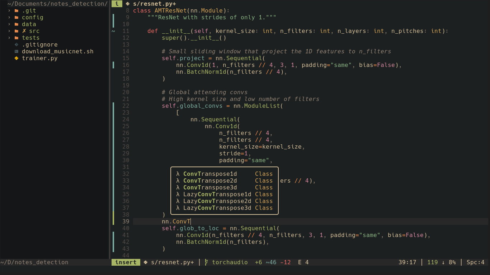
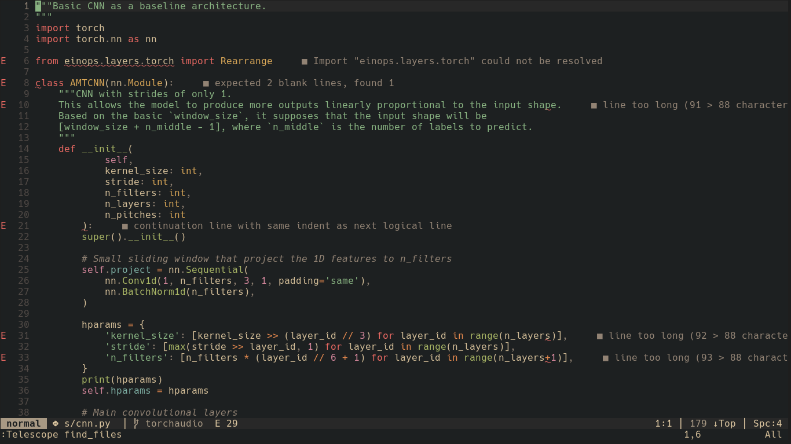
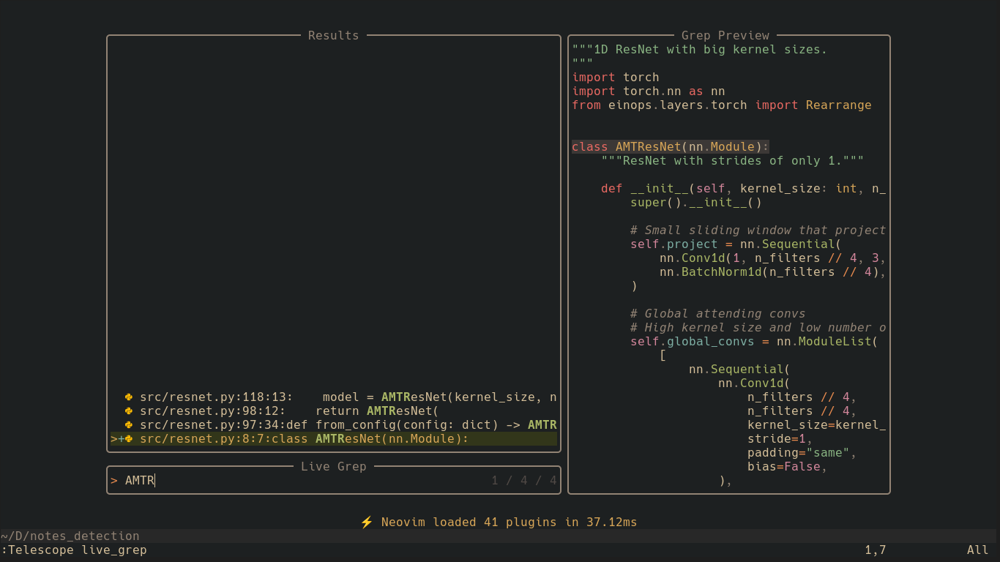

# Neovim configuration files

I tried to put up a modern neovim config.

  
  
  
  

Main components are:

* [lazy.nvim](https://github.com/folke/lazy.nvim) as a package manager.
* [mason.nvim](https://github.com/williamboman/mason.nvim) to download additional packages (linters, LSPs, ...).
* [telescope.nvim](https://github.com/nvim-telescope/telescope.nvim) to search for files.
* [nvim-treesitter](https://github.com/nvim-treesitter/nvim-treesitter) for code parsing and code actions.
* LSPs to have suggestions and linters ([nvim-lspconfig](https://github.com/neovim/nvim-lspconfig), [null-ls.nvim](https://github.com/jose-elias-alvarez/null-ls.nvim) and others).

I put a lot of comments so that the configuration is easier
to maintain and to understand.
The plugins are organized into multiple files such that each file can be deleted
without affecting (too much) the plugins of the files.

## Dependencies

Use `:checkhealth` to make sure everything is working properly.

* neovim >= 0.9 (nightlty is advised)
* curl
* git
* nerdfonts ([getnf](https://github.com/ronniedroid/getnf))
* pip, npm, cargo (optional, for `mason` to install packages)
* cmake, make and gcc or clang (optional, for `telescope-fzf-native`)
* pynvim (optional, for python)
